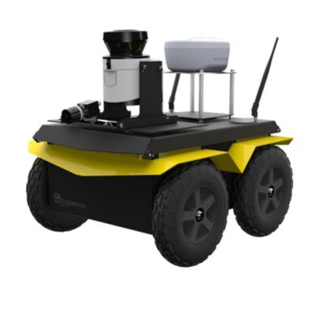
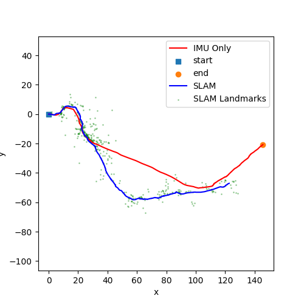
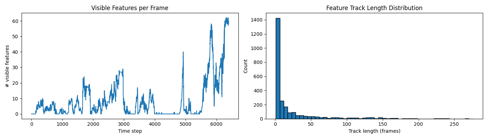

# ECE 276A Project 3: Visual-Inertial SLAM

**Course:** ECE 276A: Sensing & Estimation in Robotics  
**Institution:** University of California San Diego  

---

## Academic Integrity Notice

Please note that the actual source code for this project is hidden from the public repository to comply with university academic integrity policies. Recruiters or researchers interested in discussing the implementation details or viewing the code can contact me directly at nvanutrecht@ucsd.edu.

---

## Project Setup

This project utilizes data collected by Clearpath Jackal robots navigating outdoors on the MIT campus. The hardware setup features synchronized data streams from an Inertial Measurement Unit (IMU) and a stereo camera system. 

---

## Mathematical and Theoretical Formulation

The visual-inertial SLAM problem is formulated as a Maximum A Posteriori (MAP) estimation problem. The objective is to estimate the hidden state of the system, which consists of the robot's trajectory and the environment map.

Let the given data be $\mathcal{D}=\{z_{1:T},u_{0:T-1}\}$ and the unknown parameters be the state trajectory and map $\theta=\{T_{0:T},m\}$. The joint probability density function is factored into the prior, the observation model, and the motion model:

$$
p(\mathcal{D},\theta)=p(T_{0},m)\prod_{t=1}^{T}p_{h}(z_{t}|T_{t},m)\prod_{t=0}^{T-1}p_{f}(T_{t+1}|T_{t},u_{t})
$$

The formal objective is to find the optimal state and map parameters $\theta^{*}$ that maximize this joint posterior distribution.

---

## Technical Approach

The complete Visual-Inertial SLAM pipeline consists of three core components:

* **Feature Detection and Tracking:** A custom front-end processes raw stereo images using Shi-Tomasi corner detection and Pyramidal Lucas-Kanade optical flow to robustly extract and track visual landmarks. It enforces forward-backward consistency, epipolar constraints, and disparity constraints for robust outlier rejection.
* **IMU Localization via EKF Prediction:** A kinematic prediction model integrates IMU linear and angular velocities to estimate the robot's trajectory. The state and its uncertainty are propagated forward in time using Lie algebra kinematics on the $SE(3)$ manifold.
* **Joint Visual-Inertial SLAM Update:** An Extended Kalman Filter (EKF) backend fuses triangulated visual observations with IMU predictions. By maintaining a joint dense covariance matrix, the system continuously uses the mapped visual landmarks to correct the inherent drift of pure inertial dead-reckoning.

---

## Results

The fully coupled joint EKF effectively constrains pose uncertainty, resulting in accurate trajectory estimation and geometrically consistent environmental mapping compared to IMU-only dead-reckoning. 

---

## Full Project Report

For an in-depth analysis, comprehensive methodology, and detailed performance results across all datasets, please refer to the full project report included in this repository: (`ECE_276A_PR_3_Report.pdf`)[ECE_276A_PR_3_Report.pdf]
